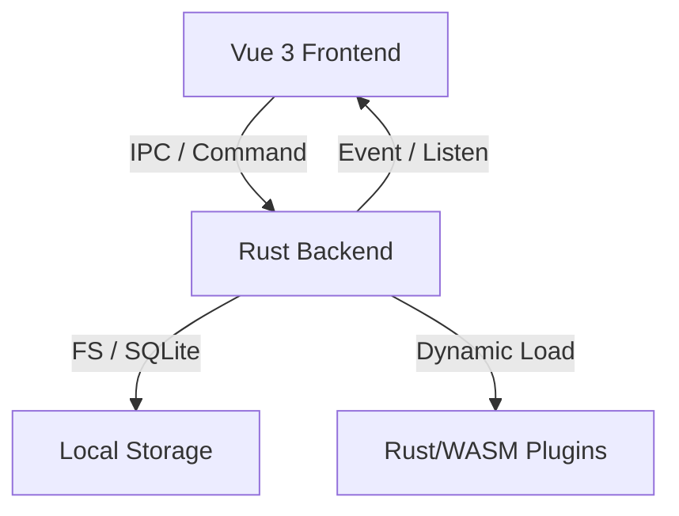

# 架构设计

Oasis 采用 **Tauri + Vue 3** 的混合架构，结合了 Rust 的高性能和 Vue 的响应式开发体验。

## 🏗️ 整体架构

### 1. 前端层 (Vue 3 + TypeScript)
- **UI 框架**: Vue 3 (Composition API)。
- **样式**: UnoCSS + Element Plus。
- **状态管理**: Pinia。
- **窗口管理**: 通过 `MacWindow` 组件模拟 macOS 窗口交互（拖拽、缩放）。
- **通信**: 使用 `@tauri-apps/api/core` 的 `invoke` 调用后端命令。

### 2. 后端层 (Tauri + Rust)
- **Tauri 核心**: 处理原生窗口、文件系统、系统通知等。
- **Command 处理器**: 定义后端逻辑并通过 `#[tauri::command]` 暴露给前端。
- **插件引擎**: 
    - **Native Plugins**: 通过 Rust 的 Trait 系统实现，支持静态链接和动态库加载。
    - **WASM Plugins**: 基于 `wasmi` 运行时的沙箱环境，支持跨平台插件。

### 3. 数据持久化
- **配置信息**: 存储在本地 JSON 文件中。
- **凭据管理**: 使用 **SQLite** (rusqlite) 存储加密后的敏感信息。

## 🔌 插件协作模式

Oasis 的核心特性是其强大的插件化能力。

1. **注册**: 在 `src/plugins/mod.rs` 中通过 `PluginRegistry` 注册插件。
2. **渲染**: 每个插件在前端拥有独立的 `PluginWindow` 容器。
3. **通信**: 插件通过 SDK 与宿主应用通信，宿主负责窗口调度和资源隔离。

## 🔐 安全设计

- **数据隔离**: 插件运行在独立的内存空间（尤其是 WASM 插件）。
- **加密方案**: 敏感数据（如凭据密码）在存储前经过 AES-256-GCM 加密，主密钥派生采用 PBKDF2。
